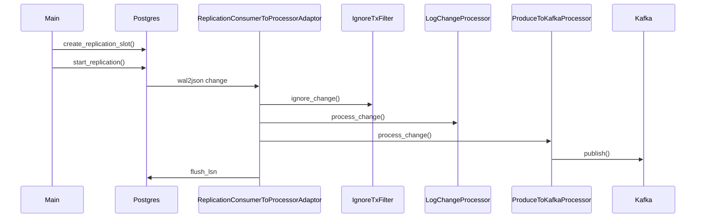

# PoC (v0.1)

### Status

* The Proof of Concept is **finished** (`v0.1.0`)
* To clone it: `git clone git@gitlab.com:hgdeoro/popyka.git --branch v0.1.0`
* To now more about the process to go from zero to PoC you can read my blog post: [From Zero to CDC: A 3-days Agile Journey to the PoC](https://hdo.dev/posts/20240406-popyka/).

### Code

So far the code is small, everything fits in [__main__.py](../blob/v0.1.0/popyka/__main__.py?ref_type=tags).

### PoC: run locally

Clone the PoC:

    $ git clone git@gitlab.com:hgdeoro/popyka.git --branch v0.1.0

Launch PostgreSql and Kafka using docker compose:

    $ make docker-compose-up
    $ make docker-compose-wait  # wait util services are up

Simulate some DB activity (insert, update, delete):

    $ make docker-db-activity-simulator-run

Run PoPyKa to read the changes from PostgreSql and write JSONs to Kafka:

    $ make docker-popyka-run-gitlab

or building the image locally (if you want to try your changes):

    $ make docker-popyka-build
    $ make docker-popyka-run

You can see the contents of the Kafka topic using ~~Kowl~~ Redpanda Console at http://localhost:8080/topics/popyka

**List of captured changes streamed to Kafka**:

**Insert**:

**Update**:

**Delete**:

