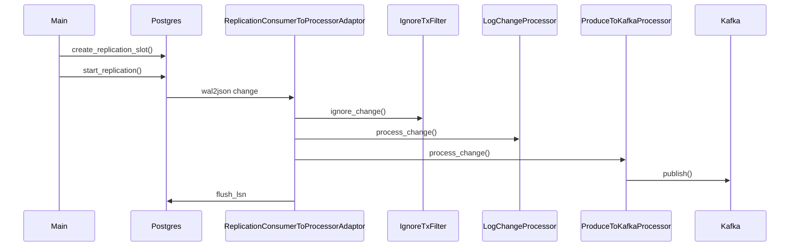

# Code

So far the code is small, everything fits in [__main__.py](./popyka/__main__.py).

# Run locally

Launch PostgreSql and Kafka using docker compose:

    $ make docker-compose-up
    $ make docker-compose-wait  # wait util services are up

Simulate some DB activity (insert, update, delete):

    $ make docker-db-activity-simulator-run

Run PoPyKa to read the changes from PostgreSql and write JSONs to Kafka:

    $ make docker-popyka-build
    $ make docker-popyka-run

You can see the contents of the Kafka topic using ~~Kowl~~ Redpanda Console at http://localhost:8080/topics/popyka

**List of captured changes streamed to Kafka**:

**Insert**:

**Update**:

**Delete**:

